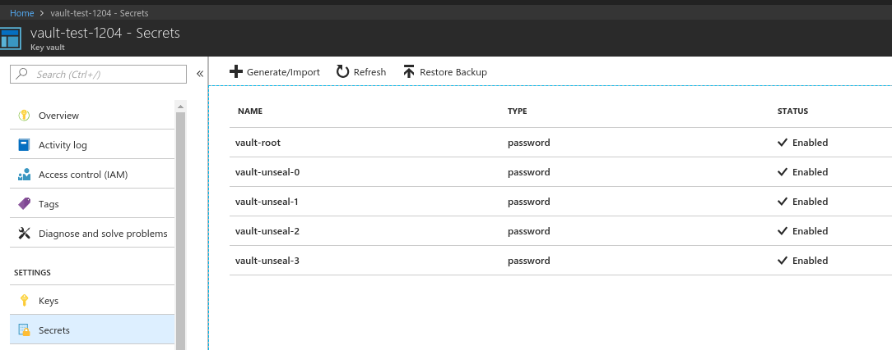

# Deploying vault for Azure storage backend and unsealing it using Azure Key Vault

## Provision kubernetes cluster using AKS

- We will create cluster `vault` using AKS

  

  Configure `.kube/config`
  
  ```console
  $ az aks get-credentials --resource-group vault-aks --name vault
  Merged "vault" as current context in /home/ac/.kube/config
  ```
  ```yaml
  $ kubectl get pods --all-namespaces
  NAMESPACE     NAME                                                              READY     STATUS    RESTARTS   AGE
  kube-system   addon-http-application-routing-default-http-backend-b8f5bcxnlw6   1/1       Running   0          33m
  kube-system   addon-http-application-routing-external-dns-764cd85d68-45lvs      1/1       Running   0          33m
  kube-system   addon-http-application-routing-nginx-ingress-controller-8648nrq   1/1       Running   1          33m
  kube-system   azureproxy-6c98c79bdd-467t4                                       1/1       Running   2          33m
  kube-system   heapster-d7c9d9b7f-vnkmd                                          2/2       Running   0          29m
  kube-system   kube-dns-v20-58bc8dcd9f-c45qn                                     3/3       Running   0          33m
  kube-system   kube-dns-v20-58bc8dcd9f-z9bjf                                     3/3       Running   0          33m
  kube-system   kube-proxy-j99vp                                                  1/1       Running   0          33m
  kube-system   kube-svc-redirect-dpvbl                                           1/1       Running   0          33m
  kube-system   kubernetes-dashboard-dcd4bc974-4nvlr                              1/1       Running   2          33m
  kube-system   omsagent-rs-576786d757-72vbh                                      1/1       Running   0          33m
  kube-system   omsagent-wkhqr                                                    1/1       Running   0          33m
  kube-system   tunnelfront-6b4674fd4f-n586r                                      1/1       Running   0          33m

  ```

- We will create storage account `vaultstorageac`. Guides to create a storage account can be found [here](https://docs.microsoft.com/en-us/azure/storage/common/storage-create-storage-account#create-a-storage-account).

- We will create container `vault` in the storage account `vaultstorageac`. This will be used for vault backend storage.

- We will create Azure Key Vault `vault-test-1204`. Guides to create key vault can be found [here](https://docs.microsoft.com/en-us/azure/key-vault/key-vault-get-started). Also, we will use the DNS name of the key vault as `vaultBaseUrl` when deploying vault.

  

- We will create a `web app/api` type Azure Active Directory Application `azure-vault`. Guides to create an Azure AD application can be found [here](https://docs.microsoft.com/en-us/azure/azure-resource-manager/resource-group-create-service-principal-portal#create-an-azure-active-directory-application). We will use the application id and key of this `azure-vault` as `client-id` and `client-secret`.

- We will give `azure-vault` application access to the secert in key vault `vault-test-1204`.

  

### Deploy vault operator

See here.

### Deploy vault

We will deploy `my-vault` on `default` namespace. We will configure it for Azure Storage Container backend. We will use `azureKeyVault` for auto initializing and unsealing. 

```yaml
apiVersion: "core.kubevault.com/v1alpha1"
kind: "VaultServer"
metadata:
  name: "my-vault"
spec:
  nodes: 1
  version: "0.10.0"
  baseImage: "vault"
  backend:
    azure:
      container: vault
      accountName:  vaultstorageac
      accountKey: <account_key>
  unsealer:
    secretShares: 4
    secretThreshold: 2
    retryPeriodSeconds: 15
    insecureTLS: true
    mode:
      azureKeyVault:
        vaultBaseUrl: https://vault-test-1204.vault.azure.net/
        tenantID: <tenant_id>
        aadClientSecret: azure-ad-client-secret
```
Here, some of fields value is redacted and `azure-ad-client-secret` is the name of the secret containing `client-id` and `client-secret`.
```yaml
apiVersion: v1
data:
  client-id: <base64_encoded_client_id>
  client-secret: <base64_encoded_client_secret>
kind: Secret
metadata:
  name: azure-ad-client-secret
  namespace: default
```

Create vault server:
```console
$ cat vault-crd.yaml
apiVersion: "core.kubevault.com/v1alpha1"
kind: "VaultServer"
metadata:
  name: "my-vault"
spec:
  nodes: 1
  version: "0.10.0"
  baseImage: "vault"
  backend:
    azure:
      container: vault
      accountName:  vaultstorageac
      accountKey: <account_key>
  unsealer:
    secretShares: 4
    secretThreshold: 2
    retryPeriodSeconds: 15
    insecureTLS: true
    mode:
      azureKeyVault:
        vaultBaseUrl: https://vault-test-1204.vault.azure.net/
        tenantID: <tenant_id>
        aadClientSecret: azure-ad-client-secret

$ kubectl apply -f vault-crd.yaml
vaultserver "my-vault" created

$ kubectl get vaultservers/my-vault -o yaml
apiVersion: core.kubevault.com/v1alpha1
kind: VaultServer
metadata:
  name: my-vault
  namespace: default
  ...
spec:
  backend:
    azure:
      accountKey: <account_key>
      accountName: vaultstorageac
      container: vault
  baseImage: vault
  nodes: 1
  unsealer:
    insecureTLS: true
    mode:
      azureKeyVault:
        aadClientSecret: azure-add-client-secret
        tenantID: <tenant_id>
        vaultBaseUrl: https://vault-test-1204.vault.azure.net/
    retryPeriodSeconds: 15
    secretShares: 4
    secretThreshold: 2
  version: 0.10.0
status:
  clientPort: 8200
  initialized: true
  phase: Running
  serviceName: my-vault
  updatedNodes:
  - my-vault-67f4db966b-4zvxx
  vaultStatus:
    active: my-vault-67f4db966b-4zvxx
    unsealed:
    - my-vault-67f4db966b-4zvxx

```
Vault operator creates a service with the same name as vault server. In this example, vault can be accessed using `my-vault` service. 

Check vault seal status:
```console
$ kubectl port-forward my-vault-67f4db966b-4zvxx 8200:8200
Forwarding from 127.0.0.1:8200 -> 8200

# run following commands on another terminal
$ export VAULT_SKIP_VERIFY="true"

$ export VAULT_ADDR='https://127.0.0.1:8200'

$ vault status
Key             Value
---             -----
Seal Type       shamir
Sealed          false
Total Shares    4
Threshold       2
Version         0.10.0
Cluster Name    vault-cluster-1b593a6d
Cluster ID      9e2b3f7a-d4f2-250a-0f61-64b226be87a6
HA Enabled      false
```

We can see vault unseal keys and root token in secrets of `vault-test-1204`:



We can see the config that used when deploying vault. The config is stored in configMap named `{metadata.name}-vault-config`. For this example, it is `my-vault-vault-config`.
```console
$ kubectl get configMaps/my-vault-vault-config -o yaml
apiVersion: v1
data:
  vault.hcl: |2

    listener "tcp" {
      address = "0.0.0.0:8200"
      cluster_address = "0.0.0.0:8201"
      tls_cert_file = "/etc/vault/tls/server.crt"
      tls_key_file  = "/etc/vault/tls/server.key"
    }

    storage "azure" {
    accountName = "vaultstorageac"
    accountKey = <account_key>
    container = "vault"
    }

kind: ConfigMap
metadata:
  labels:
    app: vault
    vault_cluster: my-vault
  name: my-vault-vault-config
  namespace: default
  ...         
```
