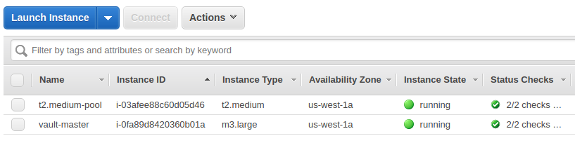
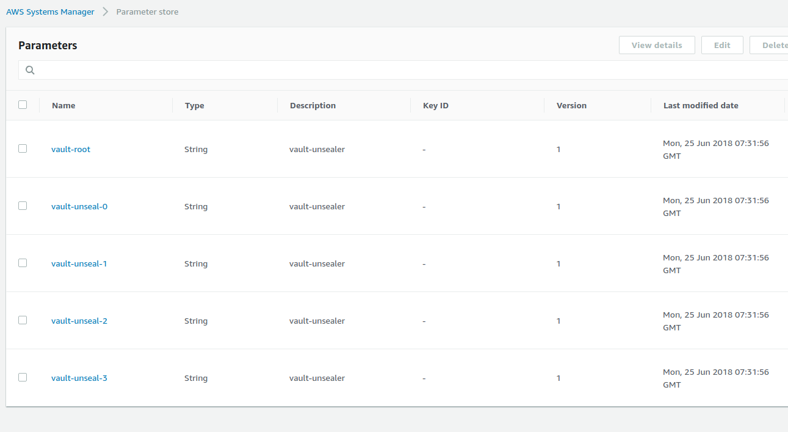

# Deploying vault for AWS s3 backend and unsealing it using awsKmsSsm

## Provision Kubernetes cluster on AWS

Here, we will provision kubernetes cluster on AWS using [pharmer](https://github.com/pharmer/pharmer). First, we will create aws credential in pharmer.
```console
$ pharmer create credential aws1
? Choose a Cloud provider:
❯ AWS
  Azure
  AzureStorage
  DigitalOcean
  GoogleCloud
  Linode
  Ovh
  Packet
  Scaleway
  Softlayer
  Vultr

? Choose a Cloud provider: AWS
Access Key Id
<access_key>
Secret Access Key
**********
```
```console
$ pharmer get credentials
AME       Provider   Data
aws        AWS        secretAccessKey=*****, accessKeyID=<access_key>

```
We will create cluster `vault` of kubernetes version `v1.9.0` in `us-west-1a` zone. The cluster will contain one master node and one worker node of size `t2.medium`.
```console
$  pharmer create cluster vault \
        --v=5 \
        --provider=aws \
        --zone=us-west-1a \
        --nodes=t2.medium=1 \
        --credential-uid=aws \
        --kubernetes-version=v1.9.0
```
```console
$ pharmer apply vault --v=10
```
```console
$ pharmer get clusters
NAME         PROVIDER   ZONE         VERSION   RUNNING SINCE   STATUS
vault        aws        us-west-1a   v1.9.0    1d              Ready     
```


Configure `.kube/config` to access kubernetes cluster
```console
$ pharmer use cluster vault
Current Kubeconfig is backed up as /home/ac/.kube/config.bak.2018-06-23T18-06.
kubectl context set to cluster `vault`.
```
```console
$ kubectl get pods --all-namespaces                                                
NAMESPACE     NAME                                                               READY     STATUS    RESTARTS   AGE
kube-system   calico-etcd-tvfs6                                                  1/1       Running   0          1d
kube-system   calico-kube-controllers-f6986b99f-f2hvc                            1/1       Running   0          1d
kube-system   calico-node-q7rvd                                                  2/2       Running   1          1d
kube-system   calico-node-zzjx2                                                  2/2       Running   0          1d
kube-system   etcd-ip-172-20-0-9.us-west-1.compute.internal                      1/1       Running   0          1d
kube-system   kube-apiserver-ip-172-20-0-9.us-west-1.compute.internal            1/1       Running   0          1d
kube-system   kube-controller-manager-ip-172-20-0-9.us-west-1.compute.internal   1/1       Running   0          1d
kube-system   kube-dns-6f4fd4bdf-828x6                                           3/3       Running   0          1d
kube-system   kube-proxy-86wbf                                                   1/1       Running   0          1d
kube-system   kube-proxy-r7xz6                                                   1/1       Running   0          1d
kube-system   kube-scheduler-ip-172-20-0-9.us-west-1.compute.internal            1/1       Running   0          1d
kube-system   kubeadm-probe-q24m2                                                1/1       Running   0          1d

```

Pharmer creates `node.{cluster-name}.pharmer` role for worker node and `master.{cluster-name}.pharmer` for master node. For this example roles are `node.vault.pharmer` and `master.vault.pharmer`. So, attach required policy for accessing s3 bucket, ssm parameter store and encryption keys to these roles.

## Deploy vault

### Deploy vault operator

See here.

### Deploy vault

We will deploy `my-vault` on `default` namespace. We will configure it for s3 backend. We will use `awsKmsSsm` for auto initializing and unsealing. We already created a s3 bucket `test-vault-s3` in `us-west-1` region.

```yaml
apiVersion: "core.kubevault.com/v1alpha1"
kind: "VaultServer"
metadata:
  name: "my-vault"
spec:
  nodes: 1
  version: "0.10.0"
  baseImage: "vault"
  backendStorage:
    s3:
      bucket: "test-vault-s3"
      region: "us-west-1"
  unsealer:
    secretShares: 4
    secretThreshold: 2
    retryPeriodSeconds: 15
    insecureTLS: true
    mode:
      awsKmsSsm:
        kmsKeyID: "65ed2c85-4915-4e82-be47-d56ccaa8019b"
```
> **Note**: Here, vault will attempt to retrieve credentials from the AWS metadata service. Please, make sure that it's has permission for s3 bucket, encryption key and amazon ssm.

Create vault server:
```console
$ cat vault-crd.yaml
apiVersion: "core.kubevault.com/v1alpha1"
kind: "VaultServer"
metadata:
  name: "my-vault"
spec:
  nodes: 1
  version: "0.10.0"
  baseImage: "vault"
  backendStorage:
    s3:
      bucket: "test-vault-s3"
      region: "us-west-1"
  unsealer:
    secretShares: 4
    secretThreshold: 2
    retryPeriodSeconds: 15
    insecureTLS: true
    mode:
      awsKmsSsm:
        kmsKeyID: "65ed2c85-4915-4e82-be47-d56ccaa8019b"
```
```console
$ kubectl apply -f vault-crd.yaml
vaultserver "my-vault" created
```
```console
$ kubectl get vaultservers/my-vault -o yaml
apiVersion: core.kubevault.com/v1alpha1
kind: VaultServer
metadata:
  name: my-vault
  namespace: default
  ...
spec:
  backendStorage:
    s3:
      bucket: test-vault-s3
      region: us-west-1
  baseImage: vault
  nodes: 1
  unsealer:
    insecureTLS: true
    mode:
      awsKmsSsm:
        kmsKeyID: 65ed2c85-4915-4e82-be47-d56ccaa8019b
    retryPeriodSeconds: 15
    secretShares: 4
    secretThreshold: 2
  version: 0.10.0
status:
  clientPort: 8200
  initialized: true
  phase: Running
  serviceName: my-vault
  updatedNodes:
  - my-vault-74d4c5db45-nfskg
  vaultStatus:
    active: my-vault-74d4c5db45-nfskg
    unsealed:
    - my-vault-74d4c5db45-nfskg

```
Vault operator creates a service with the same name as vault server. In this example, vault can be accessed using `my-vault` service. 

Check vault seal status:
```console
$ kubectl port-forward my-vault-74d4c5db45-nfskg 8200:8200
Forwarding from 127.0.0.1:8200 -> 8200

# run following commands on another terminal
$ export VAULT_SKIP_VERIFY="true"

$ export VAULT_ADDR='https://127.0.0.1:8200'

$ vault status
Key             Value
---             -----
Seal Type       shamir
Sealed          false
Total Shares    4
Threshold       2
Version         0.10.0
Cluster Name    vault-cluster-7e18c962
Cluster ID      8134d74c-0287-47ba-fe6d-80b840fd1f08
HA Enabled      false

```

We can see vault unseal keys and root token in parameter store:



Download and decrypt the root token:
```console
$ aws ssm get-parameter --name vault-root --region us-west-1 --output json | jq -r '.Parameter.Value' | base64 -d - > root.enc

$ tree .
.
└── root.enc

$ aws kms decrypt --ciphertext-blob fileb://root.enc --output text --query Plaintext --encryption-context "Tool=vault-unsealer" --region us-west-1 | base64 -d -
ce49c67f-272b-8188-7013-ea5997dde70f
```

We can see the config that used when deploying vault. The config is stored in configMap named `{metadata.name}-vault-config`. For this example, it is `my-vault-vault-config`.
```console
$ kubectl get configMaps/my-vault-vault-config -o yaml
apiVersion: v1
data:
  vault.hcl: |2

    listener "tcp" {
      address = "0.0.0.0:8200"
      cluster_address = "0.0.0.0:8201"
      tls_cert_file = "/etc/vault/tls/server.crt"
      tls_key_file  = "/etc/vault/tls/server.key"
    }

    storage "s3" {
    bucket = "test-vault-s3"
    region = "us-west-1"
    }
kind: ConfigMap
metadata:
  creationTimestamp: 2018-06-25T07:29:52Z
  labels:
    app: vault
    vault_cluster: my-vault
  name: my-vault-vault-config
  namespace: default
  ...         
```
